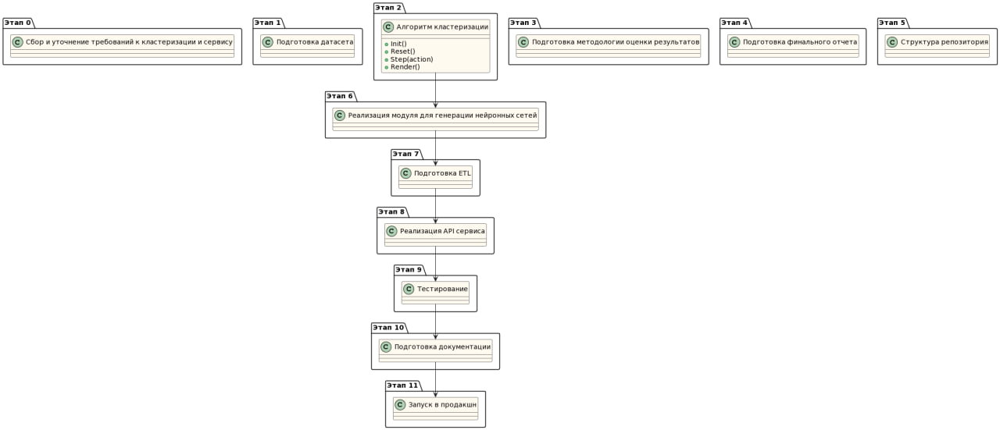
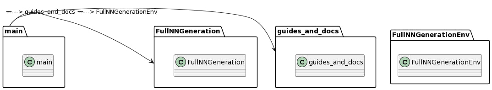
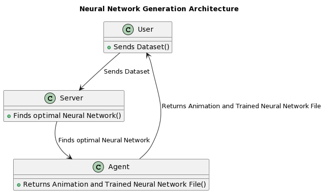

# **Сервис генерации нейронных сетей**
## **1. Цели и предпосылки**
### **1.1. Зачем идем в разработку продукта?**
**Бизнес-цель:** Создать инновационный сервис, который позволит пользователям без специальных знаний в области машинного обучения и программирования генерировать и обучать эффективные нейронные сети для решения различных задач, увеличивая доступность и использование технологии искусственного интеллекта в бизнесе и научных исследованиях. Для генерации используем RL модель.

**Почему станет лучше, чем сейчас, от использования ML:** Благодаря возможности генерации и обучения нейронных сетей без необходимости в глубоких знаниях. созданные пользователем нейронные сети могут быть адаптированы к конкретным задачам и потребностям

**Что будем считать успехом итерации с точки зрения бизнеса:** Работающий сервис генерации нейронных сетей: пользователь передаёт нам датасет в необходимом формате. Сервер с достаточными для обучения мощностями находит оптимальную нейросеть. Пользователю возвращается файл с обученной нейронкой, а так же некоторая визуализация (анимация с обучением агента).
### **1.2. Бизнес-требования и ограничения**
**Целевое решение:** RL система

**Логика работы:**

Варианты:
1) алгоритм генерации нейросети послойно
агент получается на вход в качестве состояния среды список последних метрик за последние N обучений Обучение представляет из себя создание нейросети+ обучение N эпох с отслеживанием метрик Как результат обучения агент получает лучшие значения метрик
По результатам предыдущих обучений агент принимает решение о том, как слой добавить в конце предыдущей нейросети

2) алгоритм генерации нейросети полностью
Входные данные такие же как и в пункте 1. Отличие заключается лишь в том, что агент сразу простраивает всю нейросетевую архитектуру вместо того, чтобы добавлять новый слой в конец

При таком подходе можно добавить в качестве награды уменьшение нейросети количество слоев ( оптимизация архитектур)

**Бизнес-ограничения:**

- Фиксированный набор форматов для датасетов
- Ограничения по вычислительным мощностям
- На выбор два алгоритма
- Генерируемые нейросети толкьо для некоторых типов и разделов задач (классификация, регрессия, CV)

**Критерии успеха и возможные пути развития проекта:** критерием успеха служит позитивная обратная связь пользователей.

**Возможные пути развития проекта:**
- Генерировать нейросети с более сложными архитектурами
- Генерировать нейросети под другие типы и сферы задач (NLP)
- Стильный фронтенд, визуализация внутренних процессов

### **1.3. Что входит в скоуп проекта/итерации, что не входит**
**На закрытие каких БТ подписываемся в данной итерации:** Разработка алгоритмов, API, сервера, деплой.

**Результат с точки зрения качества кода и воспроизводимости решения:**
Используется модульный подход, где каждый модуль отвечает за свою часть – предобработка данных, RL модель, серверная часть и т.д.

**Описание планируемого технического долга (что оставляем для дальнейшей продуктивизации):** Добавить логирование, авторизацию пользователей
### **1.4 Предпосылки решения**
**Проблема:**
Не все пользователи имеют доступ к достаточным вычислительным ресурсам для обучения нейронных сетей, поэтому сервис, предоставляющий доступ к вычислительным ресурсам, может быть востребован.

**Зачем нужен сервис (пример использования):**
Такой сервис нужен для облегчения процесса обучения нейронных сетей и анализа данных для специалистов, которые не имеют опыта в области машинного обучения.
## **2. Методология**
### **2.1. Постановка задачи**
- Разработать 2 RL алгоритма
- Разработать сервис, который обращается по API к RL системе для генерации нейронки 

Финальный результат модели - предоставление готового сервиса для генерации нейронной сети
 
### **2.2. Схема решения** 

### **2.3. Этапы решения**
 
#### **Этап 0. Сбор и уточнение требований к кластеризации и сервису.**
Признаки, входные данные, их формат, технические и формальные требования. 
  
#### **Этап 1. Подготовка датасета**
Подготовка единого датасета с имеющимися атрибутами. Проверка корректности данных в используемых атрибутах. 
 
#### **Этап 2. Алгоритм генерации**
##### **СТРУКТУРА КЛАССА СРЕДЫ (observation):**
**Init - объявление переменных**
- обязательные параметры
- Action space
- Observation space

**Reset** - очистить все изменения в среде

**Step** - шаг обновления среды. В него передаёт action от агента В нем генерируется новая наблюдение для агента и награда

**Render** - метод, который генерирует графическую часть

##### **ОБЪЯСНЕНИЕ РАБОТЫ ШАГА (STEP):**
- получаем на вход action
1) если мы генерируем послойно
Мы преобразовываем действие агента в новый слой, добавляем его в конец текущей архитектуры Строим нейросеть заново с учётом добавленного слоя Проводим обучение полученной модели, трассируя метрики После чего, на основании результатов обучения вычисляется награда Полученные метрики добавляются в конец массива из последних результатов обучений И этот список передаёт как наблюдение агенту вместе с наградой
2) если мы генерируем архитектуру полностью
Мы преобразовываем action от агента в нейросетевую архитектуру Проводим обучение полученной модели И возвращаем тоже самое что в пункте 1, только от агента мы получаем нейросетевую архитектуру целиком
 
#### **Этап 3. Подготовка методологии оценки результатов**
Подготовка методологии для оценки результатов работы выбранного алгоритма, а также оценка качества выданой архитектуры. 
 
#### **Этап. 4. Подготовка финального отчета**
Подготовка модуля кода для генерации финального excel-отчета по требованиям бизнеса. (Формат отчета будет представлен Product Owner’ом по результатам общения с бизнесом)
 
#### **Этап 5. Структура репозитория**

**Архитектура:**

#### **Этап 6. Реализация модуля для генерации нейронных сетей**
Разработка модуля, содержащего необходимые функции для функционирования алгоритма. Агент формирует набор слоев переменной длины в пределах от 1 до N (т.е. структура сети не имеет фиксированной длины).

#### **Этап 7. Подготовка ETL**
Создание скриптов и конструкций для обработки входных данных. Формирование DAG-ов для выполнения вычислений в среде AirFlow.

#### **Этап 8. Реализация API сервиса**
Осуществление создания API согласно выбранной архитектуре, включая разработку необходимых методов для обеспечения функциональности сервиса. Результатом является готовый Docker-образ API сервиса.

#### **Этап 9. Тестирование**
Проведение тестовой процедуры в dev-test среде (функциональные и нагрузочные испытания). Предполагается, что сервис будет использоваться не более 10 пользователями несколько раз в сутки. В случае коммерческого успеха проекта, планируется разработка полноценного приложения с фронтендом, способного выдерживать значительную нагрузку.

#### **Этап 10. Подготовка документации**
Формирование документации, описывающей функционирование алгоритма и сервиса, а также содержащей информацию о методах API и библиотеке для создания нейронных структур.

#### **Этап 11. Запуск в продакшн**
Развертывание сервиса в среде продакшн и передача поддержки dev-ops.